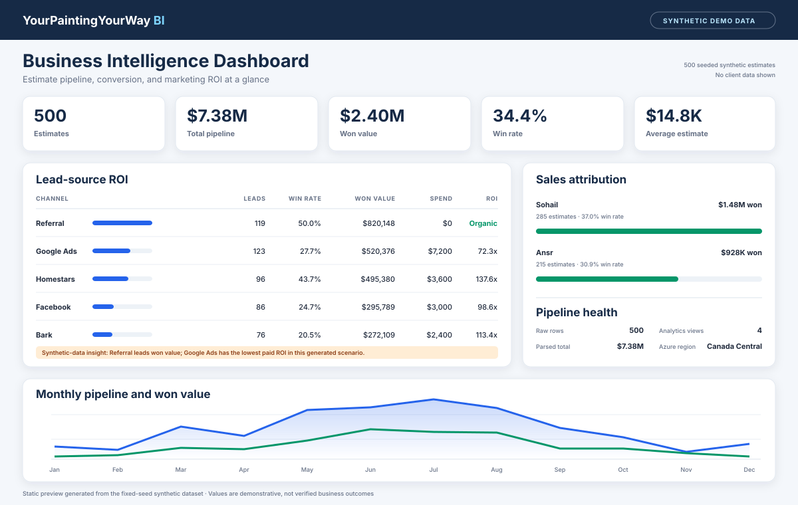

# YPYW Business Intelligence Platform

A full-stack business intelligence platform built for **YourPaintingYourWay**, a high-volume residential painting company in the GTA. The system automates data ingestion from client estimate exports and surfaces business metrics through a web dashboard.

> **Note on Data:** The included `sample_estimates.csv` is a **synthetic dataset** with randomly generated names and amounts. It mirrors the schema of the real source data (500+ client estimates) seen during development but contains no actual client information. `azure/generate_sample_data.py` then enriches it (seeded and reproducible) with synthetic sales-funnel status, salesperson, lead source, and estimate dates so the analytics layer has meaningful dimensions to report on — while preserving the original amounts (~$7.38M total). The generator's per-channel win rates are hand-tuned and the monthly marketing spends seeded by `azure/schema.sql` are placeholders, so every ROI figure derived from this data — on the dashboard or in its preview — is synthetic and illustrative of the analytics capability, not a real business result.

## Dashboard Preview

[](docs/dashboard-preview.html)

The image above (and the [HTML page](docs/dashboard-preview.html) it links to) is a
**high-fidelity static preview of the dashboard design** — hand-built HTML/SVG that
mirrors the Blazor dashboard layout (`Home.razor`). It is not a screenshot of the
running application. All values in it are computed from the repository's fixed-seed
500-row synthetic dataset and the placeholder marketing spends seeded by
`azure/schema.sql`; the ROI multiples it shows are illustrative of the analytics
capability, not real business results.

## Architecture

```
CSV Export (DropZone/)
        │
        ▼
┌─────────────────────┐
│  dataingest.py       │  Python ETL Pipeline
│  watchdog + pandas   │  Watch → Read → Clean → Load → Archive
│  + SQLAlchemy        │
└────────┬────────────┘
         ▼
┌─────────────────────┐
│  Azure SQL Database  │  Tables: RawEstimates, SalesPeople, LeadSources,
│  (serverless)        │  MarketingCosts; vEstimatesClean (typed view)
└────────┬────────────┘
         ▼
┌─────────────────────┐
│  .NET Blazor App     │  Web dashboard with Dapper ORM
│  (CPA/)              │  Targets Web, Desktop, Mobile (MAUI)
└─────────────────────┘
```

## Components

### 1. Automated ETL Pipeline (`dataingest.py`)
- **Watch:** Uses `watchdog` to monitor a DropZone folder for new CSV files in real time
- **Read:** Loads CSVs with pandas
- **Clean:** Strips and normalizes column headers
- **Load:** Uploads to Azure SQL Database via SQLAlchemy (`RawEstimates` table)
- **Archive:** Moves processed files to a `Processed/` folder with timestamp-based collision handling

### 2. SQL Database Schema (`azure/schema.sql`)
The production/Azure schema lives at `azure/schema.sql`. A non-runnable legacy SQL Server script is kept for reference at `ypyw_clean/CPA/legacy/SQLQuery1.sql`.
- `RawEstimates` — Raw landing table; client estimates ingested from CSV as source text
- `SalesPeople` — Sales team members for attribution tracking
- `LeadSources` — Marketing channels (Homestars, Google Ads, Referral, etc.)
- `MarketingCosts` — Monthly advertising spend per channel for ROI analysis
- `vEstimatesClean` — Typed view that parses raw currency text (`$24,399.00` → `DECIMAL`) and date text → `DATE` via `TRY_CONVERT`; reporting should read from this view

**Analytics views** (the reporting layer the dashboard reads from, all built over `vEstimatesClean`):
- `vKpiSummary` — single-row KPIs: total estimates, total pipeline, won value, win rate, average deal size
- `vLeadSourceRoi` — per channel: leads, won value, marketing spend, win rate, and ROI multiple (won ÷ spend)
- `vSalesByPerson` — deals, won value, and win rate per salesperson
- `vMonthlyTrend` — estimate count and pipeline value by month

The schema runs on **Azure SQL Database** (free serverless tier) rather than
LocalDB — see [Cloud Deployment (Azure)](#cloud-deployment-azure) below.

### 3. .NET Blazor Frontend (`CPA/`)
- Blazor Hybrid app targeting web, Android, iOS, Mac, and Windows
- `Home.razor` — **BI dashboard**: KPI cards (estimates, pipeline, won value, win rate, avg deal), a lead-source ROI table with inline bars, a sales-by-person breakdown, and a monthly pipeline chart (inline SVG, no chart library). Reads the analytics views via Dapper and surfaces the headline insight automatically (highest-value channel vs. lowest paid ROI).
- `Estimates.razor` — detail page listing every estimate
- `EstimateService.cs` — service layer; async Dapper queries against the analytics views
- `Models/Estimate.cs`, `Models/Analytics.cs` — DTOs mapped to the view columns
- Degrades gracefully: if no database is configured, the dashboard renders a clear "connect a database" banner instead of erroring

## Tech Stack
- **Backend:** Python 3, watchdog, pandas, SQLAlchemy
- **Database:** Azure SQL Database (free serverless tier), T-SQL
- **Cloud / IaC:** Microsoft Azure, Bicep, Azure CLI
- **Frontend:** C# / .NET 10, Blazor Hybrid, MAUI, Dapper
- **Platforms:** Web, Windows, macOS, Android, iOS

## Setup

### Prerequisites
- Python 3.x with `watchdog`, `pandas`, `sqlalchemy`, `pyodbc`
- ODBC Driver 17 or 18 for SQL Server (for Azure SQL connectivity)
- An Azure SQL Database — provision it with `azure/deploy.ps1` (see [Cloud Deployment (Azure)](#cloud-deployment-azure))
- .NET 10 SDK

### Running the ETL Pipeline
First configure credentials: copy `azure/.env.example` to `azure/.env` and fill in your values (or run `azure/deploy.ps1`, which provisions the database for you).
```bash
pip install watchdog pandas sqlalchemy pyodbc
python ypyw_clean/dataingest.py
```
The watcher creates a `DropZone/` folder (under `ypyw_clean/YourPaintingYourWay/`) and ingests any CSV dropped into it. To bulk-load the bundled synthetic sample instead, run `python azure/seed_sample_data.py`.

### Running the Blazor App
```bash
cd ypyw_clean/CPA/CPA/CPA.Web
dotnet run
```

> **Connection string:** the app reads `ConnectionStrings:YpywDatabase` (e.g. the
> environment variable `ConnectionStrings__YpywDatabase`). Point it at the Azure
> database provisioned by `azure/deploy.ps1`, or at a local SQL Server / LocalDB
> instance after applying `azure/schema.sql`. With no connection string set, the
> dashboard still loads and shows a "connect a database" banner instead of erroring.

## Cloud Deployment (Azure)

The relational backend targets a fully managed **Azure SQL Database** in place
of the original local SQL Server (LocalDB) design. The stack is declared as
reproducible **Infrastructure-as-Code** with Bicep and is deployable with a
single PowerShell runbook; the resource names below are the values defined in
`azure/main.bicep` and `azure/deploy.ps1`.

### Architecture

```
┌──────────────────────────── Resource Group: rg-ypyw-bi (canadacentral) ───┐
│                                                                            │
│   ┌────────────────────────────────────┐                                  │
│   │  Logical SQL Server                 │   ypyw-sql-ahmedsohail           │
│   │  ypyw-sql-ahmedsohail.database...   │   (admin: ypywadmin)             │
│   │                                     │                                  │
│   │   ┌─────────────────────────────┐   │                                  │
│   │   │  Azure SQL Database          │   │   ypyw-bi-db                     │
│   │   │  Free serverless tier        │   │   auto-pause when idle → ~$0     │
│   │   │  RawEstimates + clean view,  │   │                                  │
│   │   │  SalesPeople, LeadSources... │   │                                  │
│   │   └─────────────────────────────┘   │                                  │
│   │   Firewall: client IP only          │                                  │
│   └────────────────────────────────────┘                                  │
└────────────────────────────────────────────────────────────────────────────┘
```

| Resource        | Name                                         | Notes                          |
|-----------------|----------------------------------------------|--------------------------------|
| Resource group  | `rg-ypyw-bi`                                  | Region `canadacentral`         |
| Logical server  | `ypyw-sql-ahmedsohail`                        | FQDN `…database.windows.net`   |
| Database        | `ypyw-bi-db`                                  | **Free serverless** tier       |
| Admin user      | `ypywadmin`                                   | Password via env var only      |

### Highlights

- **Infrastructure-as-Code:** the entire SQL stack (server, serverless database,
  and a least-privilege firewall rule scoped to the deploying machine's IP) is
  declared in `azure/main.bicep` and deployed idempotently via Azure CLI.
- **One-command, repeatable deployment:** `azure/deploy.ps1` creates the resource
  group, auto-detects the client public IP, deploys the Bicep template, and
  applies the T-SQL schema with `sqlcmd` — end to end with no manual portal clicks.
- **Raw-to-clean transformation:** `RawEstimates` archives the source CSV text
  faithfully, and the `vEstimatesClean` view parses currency strings
  (`$24,399.00` → `DECIMAL`) and dates via `TRY_CONVERT`, NULL-safe by design.
  The bundled 500-row synthetic dataset totals ≈ $7.38M once amounts are parsed.
- **Secure secret handling:** the SQL admin password is never committed; it is read
  from the `SQL_ADMIN_PASSWORD` environment variable and passed to Azure as a
  secure parameter.
- **Cost-engineered to ~$0:** the database runs on Azure's **free serverless** tier
  and **auto-pauses when idle**, so an occasionally-queried BI workload incurs no
  monthly compute charge **within the free-tier allowance**. See
  [`azure/DEPLOY.md`](azure/DEPLOY.md) for the full cost breakdown and runbook.

## Status
Active development. Where each layer stands:

- **ETL pipeline (`ypyw_clean/dataingest.py`):** implemented; the pytest suite in
  `ypyw_clean/tests/` covers the header-cleaning and archive collision-handling
  logic and runs in CI on every push.
- **Database schema and analytics views (`azure/schema.sql`):** written with
  idempotent guards and deployable to Azure SQL via the Bicep template and
  `azure/deploy.ps1` runbook. The views (`vEstimatesClean`, `vKpiSummary`,
  `vLeadSourceRoi`, `vSalesByPerson`, `vMonthlyTrend`) are not yet covered by
  automated tests.
- **Blazor BI dashboard (`ypyw_clean/CPA/`):** implemented — KPI cards, the
  lead-source ROI table, sales-by-person, and the monthly pipeline chart read the
  analytics views via Dapper. It requires a provisioned, seeded database to show
  data; without a connection string it renders a "connect a database" banner.
  There is no automated end-to-end verification of the deployed schema plus
  dashboard yet, and `docs/dashboard-preview.html` is a static design preview,
  not evidence of a verified deployment.

Current work: automated end-to-end verification, CRUD on the estimates page, and
drill-downs from the dashboard cards.

## Security

See [SECURITY.md](SECURITY.md) for a threat model and NIST CSF 2.0 control mapping.
