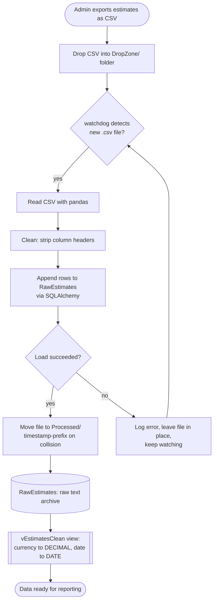
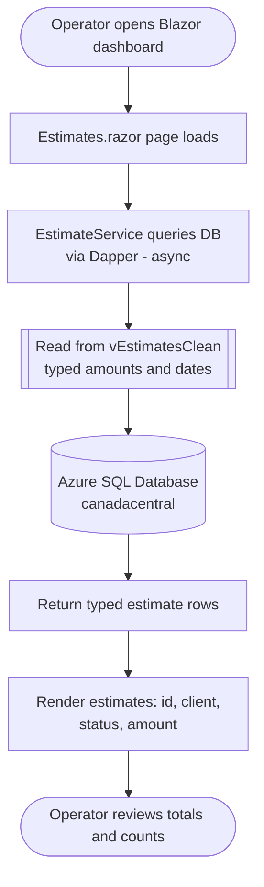
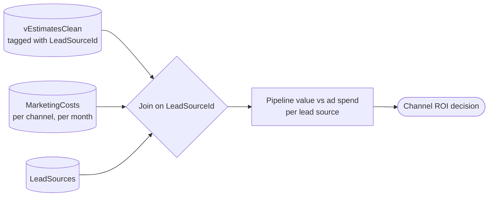

# YPYW Business Intelligence — Requirements Specification

**Document type:** Business / system requirements
**Project:** YPYW Business Intelligence Platform
**Status:** Living document — core ETL, Azure backend, analytics views, and the BI dashboard are implemented (the ETL is unit-tested in CI; the SQL views and dashboard have no automated end-to-end verification yet); dashboard CRUD and drill-downs are in progress
**Last updated:** 2026-06-29

This document captures the business context, stakeholders, scope, and the
functional and non-functional requirements for the YPYW Business Intelligence
(BI) platform. Every requirement here is traceable to a real component of the
system: the Python ETL pipeline (`ypyw_clean/dataingest.py`), the synthetic-data
generator (`azure/generate_sample_data.py`), the Azure SQL schema and analytics
views (`azure/schema.sql`), the Azure Infrastructure-as-Code (`azure/`), and the
Blazor BI dashboard (`ypyw_clean/CPA/`).

---

## 1. Background & Problem Statement

**YourPaintingYourWay (YPYW)** is a high-volume residential painting company
operating in the Greater Toronto Area (GTA). The business generates a large
number of customer estimates — the development dataset alone reflects 500+
client estimates — sourced from several marketing channels (Homestars, Bark,
Facebook, Google Ads, and word-of-mouth referrals).

Today, estimate data lives in CSV exports pulled from the company's estimating
tool. Each export contains the document id, client name, an estimate expiry
date, a status (e.g. `issued`), and the estimate amount as a formatted currency
string (for example `"$24,399.00"`). The amounts and dates are stored as free
text, exactly as exported.

**The problem:** estimate tracking and reporting are manual. A new CSV export
has to be opened by hand, eyeballed, and totalled in a spreadsheet. Because the
amounts are text (dollar signs, thousands separators) and dates are inconsistent
text, simple questions are slow and error-prone to answer:

- *What is the total dollar value of estimates we issued this month?*
- *How many estimates are still open vs. closed?*
- *Which lead source produced the most pipeline, and was it worth the ad spend?*

There is no single source of truth, no automation, and no analytics layer. Every
new export means repeating the same manual cleanup, and the marketing-spend data
needed to judge channel ROI is not connected to the estimate data at all.

**The solution this project delivers:** a small, automated BI platform that
watches for new CSV exports, ingests and cleans them into a managed cloud
database, exposes a typed/analytics-ready view of the data, and surfaces the
numbers through a web dashboard — at effectively zero monthly infrastructure
cost.

---

## 2. Stakeholders and Goals

| Stakeholder | Role | Primary goals |
|-------------|------|---------------|
| **Business owner / operator (YPYW)** | Consumes the numbers | See accurate, up-to-date estimate totals and counts without manual spreadsheet work; understand which marketing channels pay for themselves. |
| **Office / admin staff** | Produces the source data | Drop a CSV export into a folder and have it ingested automatically; not have to re-clean or re-key data. |
| **Sales people (Sohail, Ansr)** | Subjects of attribution | Have estimates attributed to the right person so individual performance is visible. |
| **Marketing (channel owner)** | ROI decision-maker | Compare pipeline generated per lead source against monthly ad spend to decide where to invest. |
| **Developer / maintainer** | Builds and runs the system | A reproducible, low-cost, secure stack that is easy to redeploy and reason about. |
| **Data subjects (clients)** | Named in the data | Their personal data (names) is handled securely and kept within Canada. |

---

## 3. Scope, Assumptions, and Constraints

### 3.1 In scope

- Automated ingestion of estimate CSV exports dropped into a watched folder.
- Lightweight cleaning of those CSVs (header normalization) on ingest.
- Loading raw rows into a managed Azure SQL Database as a faithful archive.
- A typed "clean" SQL view that parses currency text → `DECIMAL` and date text →
  `DATE` for reporting.
- Reference/analytics tables for sales people, lead sources, and monthly
  marketing costs to support attribution and ROI analysis.
- A Blazor web/hybrid **BI dashboard**: KPI summary (estimates, pipeline, won
  value, win rate, average deal), lead-source ROI, sales-by-person, and a monthly
  pipeline trend — each read from a dedicated analytics view.
- **Analytics views** over the clean view (`vKpiSummary`, `vLeadSourceRoi`,
  `vSalesByPerson`, `vMonthlyTrend`) that compute win rate and channel ROI.
- A **reproducible synthetic-data generator** that enriches the sample estimates
  with status, salesperson, lead source, and dates for demo/analytics.
- Idempotent (safely re-runnable) database provisioning and seeding.
- Reproducible cloud provisioning of the database via Infrastructure-as-Code.

### 3.2 Out of scope (for this phase)

- Editing or entering estimates inside the platform (the estimating tool remains
  the system of record for data entry). Dashboard CRUD is a planned future
  enhancement, not a current commitment.
- Real-time streaming or sub-minute latency; ingestion is batch/file-driven.
- Authentication, multi-user roles, and audit logging in the dashboard.
- Automated assignment of `SalesPersonId` / `LeadSourceId` from a *live* CSV
  export — the production ingest pipeline does not infer these tags. (For the
  demo dataset they are assigned by `generate_sample_data.py`.)
- Migrating historical estimates that were never exported to CSV.
- Predictive analytics / forecasting.

### 3.3 Assumptions

- CSV exports follow a stable column layout: `Document Id`, `Client Name`,
  `Estimate Expires Date`, `Status`, `Estimate Amount`.
- `Document Id` is supplied by the source system and is not guaranteed unique in
  the landing table (the table uses its own surrogate key, `EstimateRowId`).
- Amounts are exported as currency text (`$`, thousands separators); dates may be
  blank or inconsistently formatted and must be parsed defensively.
- A person dropping a file into the watch folder has done so intentionally and
  the file is a complete, well-formed CSV.
- The deploying machine has the Azure CLI, `sqlcmd`, and an ODBC driver
  available, and the operator can supply Azure credentials.

### 3.4 Constraints

- Data must reside in Canada (`canadacentral` region).
- Infrastructure must run at effectively $0/month within Azure's free serverless
  allowance.
- The SQL admin password must never be committed to source control.

---

## 4. Functional Requirements

Functional requirements are numbered `FR-n` and each is tied to the component
that implements (or is planned to implement) it.

> **Legend:** ✅ implemented · 🔜 planned / in progress

| ID | Requirement | Source component | Status |
|----|-------------|------------------|--------|
| **FR-1** | The system **shall watch a designated DropZone folder** and detect when a new `.csv` file is created in it, triggering ingestion automatically without manual invocation. | `dataingest.py` (`watchdog` `Observer` + `IngestHandler.on_created`) | ✅ |
| **FR-2** | On detecting a new CSV, the system **shall read the file** into a tabular structure for processing. | `dataingest.py` (`pd.read_csv`) | ✅ |
| **FR-3** | The system **shall clean column headers** on ingest by stripping surrounding whitespace, so minor formatting drift in exports does not break the load. | `dataingest.py` (`df.columns.str.strip()`) | ✅ |
| **FR-4** | The system **shall load the ingested rows** into the `RawEstimates` table in Azure SQL, appending to existing data rather than overwriting it. | `dataingest.py` (`df.to_sql('RawEstimates', if_exists='append')`); `schema.sql` (`RawEstimates`) | ✅ |
| **FR-5** | `RawEstimates` **shall preserve the source data faithfully as text** — currency amounts and dates are stored exactly as exported (`$24,399.00`, raw date text), so the landing table is an auditable archive of what was received. | `schema.sql` (`[Estimate Amount] NVARCHAR(50)`, `[Estimate Expires Date] NVARCHAR(50)`) | ✅ |
| **FR-6** | After a successful load, the system **shall archive the processed file** by moving it to a `Processed/` folder, and **shall avoid name collisions** by prefixing a timestamp when a file of the same name already exists. | `dataingest.py` (`os.rename`, timestamp collision handling) | ✅ |
| **FR-7** | If processing a file fails, the system **shall not crash**; it shall report the error and continue watching for subsequent files. | `dataingest.py` (`try/except` in `process_data`, watcher loop continues) | ✅ |
| **FR-8** | The system **shall expose a typed, analytics-ready view** (`vEstimatesClean`) that parses the raw currency text into `DECIMAL(12,2)` and the raw date text into `DATE`, NULL-safely (invalid values become `NULL` rather than failing). | `schema.sql` (`vEstimatesClean`, `TRY_CONVERT`, `REPLACE`) | ✅ |
| **FR-9** | All reporting and dashboard queries **shall read from `vEstimatesClean`**, not from the raw-text landing table, so consumers always receive correctly typed values. | `schema.sql` (the view); `EstimateService.cs` now selects from `dbo.vEstimatesClean` | ✅ |
| **FR-10** | The system **shall maintain reference data for sales people** (`SalesPeople`) so estimates can be attributed to an individual. | `schema.sql` (`SalesPeople`, seeded `Sohail`, `Ansr`) | ✅ |
| **FR-11** | The system **shall maintain reference data for lead sources** (`LeadSources`) representing the marketing channels an estimate can originate from. | `schema.sql` (`LeadSources`, seeded Homestars/Bark/Facebook/Google Ads/Referral) | ✅ |
| **FR-12** | The system **shall record monthly marketing spend per channel** (`MarketingCosts`) to enable cost-vs-pipeline ROI analysis, linked to a lead source. | `schema.sql` (`MarketingCosts` with `FK_MarketingCosts_LeadSources`) | ✅ |
| **FR-13** | `RawEstimates` **shall carry optional attribution tags** (`SalesPersonId`, `LeadSourceId`) as foreign keys, so estimates can later be linked to a sales person and a lead source. | `schema.sql` (`FK_RawEstimates_SalesPeople`, `FK_RawEstimates_LeadSources`) | ✅ |
| **FR-14** | The system **shall provide a web dashboard** that displays estimate data to the business operator. | `Estimates.razor`, `EstimateService.cs` (Dapper); compiles and reads the clean view | ✅ |
| **FR-15** | The database schema **shall be deployable repeatably and idempotently** — every object is guarded so the schema script can be re-run without error. | `schema.sql` (`IF NOT EXISTS` / `CREATE OR ALTER`); `deploy.ps1` | ✅ |
| **FR-16** | Lookups on `Document Id` **shall remain fast** even though it is not the primary key, via a supporting non-clustered index. | `schema.sql` (`IX_RawEstimates_DocumentId`) | ✅ |
| **FR-17** | The system **shall provide a reproducible synthetic-data generator** that enriches the sample estimates with a status funnel (`Won`/`Lost`/`Pending`), salesperson, lead source, and dates, using a fixed seed and preserving the original amounts (~$7.38M total). | `azure/generate_sample_data.py` | ✅ |
| **FR-18** | The system **shall seed monthly marketing spend per paid channel** so channel ROI can be computed (referral/organic carries $0 spend). | `schema.sql` (`MarketingCosts` seed) | ✅ |
| **FR-19** | The system **shall expose analytics views** over `vEstimatesClean` for a KPI summary, lead-source ROI, sales-by-person, and monthly trend. | `schema.sql` (`vKpiSummary`, `vLeadSourceRoi`, `vSalesByPerson`, `vMonthlyTrend`) | ✅ |
| **FR-20** | The BI dashboard **shall display KPI cards, a lead-source ROI breakdown (win rate + ROI multiple), a sales-by-person table, and a monthly pipeline chart**, and shall surface the headline ROI insight automatically. | `Home.razor`, `EstimateService.cs`, `Models/Analytics.cs` | ✅ |
| **FR-21** | If no database is configured, the dashboard **shall degrade gracefully** with a clear "connect a database" message rather than erroring. | `Home.razor` / `Estimates.razor` (try/catch + banner) | ✅ |
| **FR-22** | Re-seeding the database **shall be idempotent** — re-running the seeder clears prior rows so data is never duplicated. | `seed_sample_data.py` (`DELETE FROM RawEstimates` before load) | ✅ |

---

## 5. Non-Functional Requirements

Non-functional requirements are numbered `NFR-n`.

### Reliability & robustness
- **NFR-1 — Fault isolation:** a malformed or failing CSV must not stop the
  pipeline. The watcher continues running and processes subsequent files
  (`process_data` is wrapped in `try/except`).
- **NFR-2 — No silent data loss:** a file is only moved to `Processed/` after a
  successful load; failed files remain in place for inspection/retry.
- **NFR-3 — Idempotent provisioning:** the schema and the deployment runbook can
  be re-run safely (guarded DDL, `CREATE OR ALTER` view), so redeploying never
  corrupts or duplicates schema objects.
- **NFR-4 — Defensive parsing:** the clean view uses `TRY_CONVERT`, so bad or
  missing dates/amounts yield `NULL` instead of breaking reporting queries.

### Cost
- **NFR-5 — Effectively $0/month:** infrastructure runs on Azure SQL Database's
  **free serverless** tier and **auto-pauses when idle**, so an occasionally
  queried BI workload incurs no monthly compute charge within the free-tier
  allowance (see `azure/DEPLOY.md` for the cost breakdown).

### Security & least privilege
- **NFR-6 — No committed secrets:** the SQL admin password is read from the
  `SQL_ADMIN_PASSWORD` environment variable and passed to Azure as a secure
  parameter; it is never stored in source control. The pipeline refuses to start
  if the variable is unset (`dataingest.py` raises on missing password).
- **NFR-7 — Encrypted connections:** the ETL connects to Azure SQL with
  `Encrypt=yes` and `TrustServerCertificate=no` (`dataingest.py`).
- **NFR-8 — Least-privilege network exposure:** the SQL server firewall is scoped
  to the deploying machine's public IP only, declared in `azure/main.bicep`
  (no open-to-internet rule).

### Data residency
- **NFR-9 — Canadian data residency:** all data and compute are provisioned in
  the `canadacentral` Azure region (`rg-ypyw-bi`), keeping client personal data
  (names) within Canada.

### Maintainability & portability
- **NFR-10 — Infrastructure-as-Code:** the full SQL stack (server, database,
  firewall rule) is declared in Bicep and deployed via a single PowerShell
  runbook (`azure/deploy.ps1`), so the environment is reproducible and
  version-controlled.
- **NFR-11 — Configuration over hard-coding:** connection details and folder
  paths are configurable via environment variables with sensible fallbacks
  (`dataingest.py`).

---

## 6. User Flows

### 6.1 Estimate-ingestion flow

How a CSV export becomes clean, queryable data with no manual cleanup.

### 6.2 Dashboard-viewing flow

How the business operator reads the numbers.

### 6.3 Marketing-ROI flow (analytical) — implemented via `vLeadSourceRoi`

How pipeline is compared against ad spend by channel (implemented in the
`vLeadSourceRoi` view and surfaced on the dashboard).

---

## 7. Success Criteria / Acceptance Criteria

Each criterion is measurable and maps back to one or more requirements.

| # | Acceptance criterion | Verifies | How to measure |
|---|----------------------|----------|----------------|
| **AC-1** | Dropping a well-formed CSV into `DropZone/` results in all its rows appended to `RawEstimates` with **no manual steps**, and the file appears in `Processed/`. | FR-1…FR-6 | Drop the 500-row sample; confirm `RawEstimates` row count increases by 500 and the file moved. |
| **AC-2** | A second file with the same name is archived **without overwriting** the first (timestamp prefix applied). | FR-6 | Drop the same filename twice; confirm two distinct files in `Processed/`. |
| **AC-3** | A deliberately malformed CSV produces a logged error, **leaves the bad file in place**, and the watcher keeps running and successfully processes the next valid file. | FR-7, NFR-1, NFR-2 | Drop a broken file, then a valid one; confirm only the valid one is archived and the process is still alive. |
| **AC-4** | `vEstimatesClean` returns **correctly typed** amounts and dates, with the parsed total over the 500 sample rows reconciling to the expected figure (≈ **$7.38M**). | FR-8, NFR-4 | `SELECT SUM(EstimateAmount) FROM vEstimatesClean;` matches the dataset's expected total (≈ $7.38M, the sum of the sample CSV amounts). |
| **AC-5** | Rows with blank/invalid dates or amounts surface as `NULL` in the clean view rather than causing query failure. | FR-8, NFR-4 | Query the view over rows with empty `Estimate Expires Date`; confirm `NULL`, no error. |
| **AC-6** | Re-running `schema.sql` (or `deploy.ps1`) on an existing database completes **without error** and does not duplicate or drop objects. | FR-15, NFR-3 | Run the schema twice; confirm clean second run. |
| **AC-7** | The dashboard renders estimate rows (id, client, status, amount) sourced from `vEstimatesClean`. | FR-9, FR-14 | Load the Blazor page; confirm typed values match the view. |
| **AC-8** | No SQL admin password is **committed to source control** (any local `azure/.env` is gitignored and untracked), and the ETL **fails fast** with a clear error when `SQL_ADMIN_PASSWORD` is unset. | NFR-6 | `git ls-files` shows no `.env`/secret tracked; run ETL without the env var and confirm it raises. |
| **AC-9** | All provisioned resources reside in `canadacentral`, and the SQL firewall permits **only** the deploying machine's IP. | NFR-8, NFR-9 | Inspect deployed resources / Bicep; confirm region and single scoped firewall rule. |
| **AC-10** | Over a representative period of light, intermittent querying, the database incurs **no compute charge** beyond the free-tier allowance (idle auto-pause observed). | NFR-5 | Review Azure cost report against `azure/DEPLOY.md` expectations. |
| **AC-11** | The analytics views return a coherent funnel: overall win rate = Won / (Won + Lost) ≈ **34%** over the sample, and per-channel win rates differ by source. | FR-17, FR-19 | `SELECT * FROM vKpiSummary;` and `SELECT * FROM vLeadSourceRoi;` — confirm rates. |
| **AC-12** | `vLeadSourceRoi` ranks **Referral highest in won value at $0 spend** (organic) and computes an ROI multiple for each paid channel, exposing the lowest-ROI paid channel as the reallocation candidate. | FR-18, FR-19 | Query `vLeadSourceRoi`; confirm Referral organic and ROI ordering. |
| **AC-13** | The dashboard renders KPI cards, the lead-source ROI table, sales-by-person, and the monthly chart from the analytics views, and prints the auto-generated insight line. | FR-20 | Load the dashboard against seeded data; confirm every section populates. |
| **AC-14** | With no connection string set, the dashboard loads and shows the "connect a database" banner instead of throwing. | FR-21 | Run the app with `ConnectionStrings__YpywDatabase` unset; confirm the banner. |

---

## Appendix A — Source CSV / Data Dictionary

The estimate export (and the synthetic `sample_estimates.csv`, 500 rows) has the
following columns, mapped to their storage in `RawEstimates` and their typed form
in `vEstimatesClean`:

| CSV column | RawEstimates column | Type (raw) | vEstimatesClean | Type (clean) |
|------------|---------------------|------------|------------------|--------------|
| `Document Id` | `[Document Id]` | `INT` | `DocumentId` | `INT` |
| `Client Name` | `[Client Name]` | `VARCHAR(500)` | `ClientName` | `VARCHAR` |
| `Estimate Expires Date` | `[Estimate Expires Date]` | `NVARCHAR(50)` (raw text, often blank) | `EstimateExpiresDate` | `DATE` (`TRY_CONVERT`) |
| `Status` | `[Status]` | `VARCHAR(50)` (`Won`/`Lost`/`Pending` in the enriched sample) | `Status` | `VARCHAR` |
| `Estimate Amount` | `[Estimate Amount]` | `NVARCHAR(50)` (e.g. `"$24,399.00"`) | `EstimateAmount` | `DECIMAL(12,2)` |
| `SalesPersonId` *(enriched)* | `SalesPersonId` | `INT NULL` FK | `SalesPersonId` | `INT` |
| `LeadSourceId` *(enriched)* | `LeadSourceId` | `INT NULL` FK | `LeadSourceId` | `INT` |
| *(surrogate key)* | `EstimateRowId` | `INT IDENTITY` PK | `EstimateRowId` | `INT` |

> **Note:** the bundled `sample_estimates.csv` is synthetic — randomly generated
> names and amounts that mirror the real schema but contain no actual client
> data — and is enriched by `generate_sample_data.py` with status, salesperson,
> lead source, and dates (original amounts preserved, ~$7.38M total).
